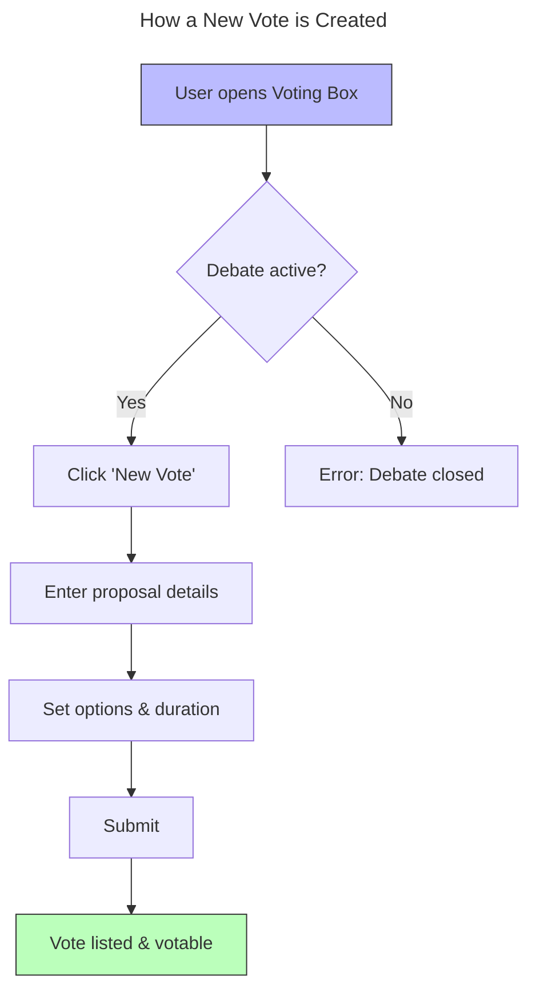

# Welcome to My Manual 2

This is your home page.

- [About page →](about.md)

## Title 2
wefwerfwerfwef werfwef wef w

### New Vote 1

Alternative Collapsible Tech Section

More technical content here (native HTML, no styling needed).

### New Vote

tester

=== "[ FEATURES ]"
    Simple overview: How to use the feature from a user perspective. xxx
    
    This is the default view shown to business users.
    Additional paragraphs go here, also indented by 4 spaces.

=== "[ TECHNICAL NOTES ]"
    Business Guidance: Users start a vote by filling a simple form.
